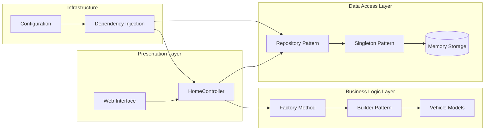
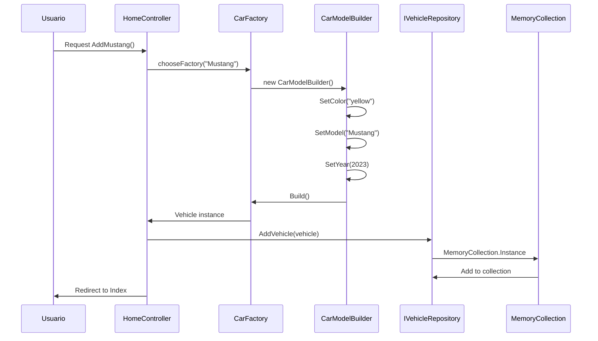
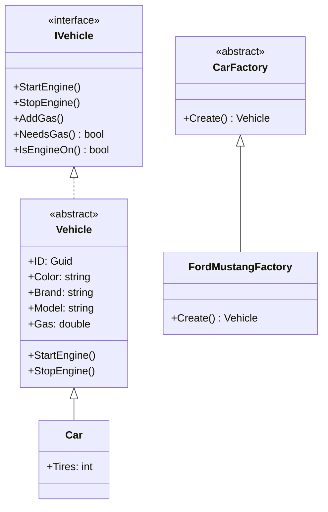

# 🚗 Design Patterns - Vehicle Management System

[](https://dotnet.microsoft.com/)
[](https://docs.microsoft.com/en-us/aspnet/core/)
[](https://docs.microsoft.com/en-us/dotnet/csharp/)
[](LICENSE)

Un sistema web de gestión de vehículos desarrollado en **ASP.NET Core MVC** que implementa múltiples **patrones de diseño** de forma práctica y educativa.

## 📋 Tabla de Contenidos

- [🎯 Descripción](#-descripción)
- [✨ Características](#-características)
- [🏗️ Patrones de Diseño Implementados](#️-patrones-de-diseño-implementados)
- [📊 Arquitectura del Sistema](#-arquitectura-del-sistema)
- [🛠️ Tecnologías Utilizadas](#️-tecnologías-utilizadas)
- [📁 Estructura del Proyecto](#-estructura-del-proyecto)
- [🚀 Instalación y Configuración](#-instalación-y-configuración)
- [📖 Uso del Sistema](#-uso-del-sistema)
- [🔄 Flujo de Funcionamiento](#-flujo-de-funcionamiento)
- [📐 Diagramas](#-diagramas)
- [🧪 Ejemplos de Código](#-ejemplos-de-código)
- [⚠️ Consideraciones](#️-consideraciones)
- [🔮 Futuras Mejoras](#-futuras-mejoras)
- [👥 Contribuciones](#-contribuciones)
- [📄 Licencia](#-licencia)

## 🎯 Descripción

Este proyecto es una **aplicación web educativa** que demuestra la implementación práctica de **6 patrones de diseño** fundamentales en el desarrollo de software. El sistema permite gestionar diferentes tipos de vehículos (carros y motocicletas) con operaciones CRUD completas y control de estado del motor.

### 🎓 Propósito Educativo

- Demostrar la aplicación práctica de patrones de diseño
- Mostrar cómo múltiples patrones pueden trabajar juntos
- Proporcionar ejemplos de código limpio y bien estructurado
- Ilustrar principios SOLID en acción

## ✨ Características

### 🚗 Gestión de Vehículos
- ➕ **Agregar vehículos** de diferentes modelos (Mustang, Explorer, Escape)
- 🔍 **Visualizar lista** de vehículos con estado actual
- 🔧 **Control de motor** (encender/apagar)
- ⛽ **Gestión de combustible** (llenar tanque)
- 📊 **Estado en tiempo real** de cada vehículo

### 🏗️ Arquitectura Robusta
- 🔄 **Inyección de dependencias** nativa de ASP.NET Core
- 📚 **Separación de responsabilidades** por capas
- 🎨 **Interfaces limpias** y desacopladas
- 🔧 **Fácil extensibilidad** para nuevos tipos de vehículos

## 🏗️ Patrones de Diseño Implementados

El proyecto implementa **6 patrones de diseño** distribuidos en las tres categorías principales:

### 🎨 Patrones Creacionales

#### 1. **Factory Method Pattern** 🏭
```csharp
public abstract class CarFactory
{
    public abstract Vehicle Create();
}

public class FordMustangFactory : CarFactory
{
    public override Vehicle Create()
    {
        return new CarModelBuilder()
            .SetColor("yellow")
            .SetModel("Mustang")
            .SetYear(2023)
            .Build();
    }
}
```

#### 2. **Builder Pattern** 🔧
```csharp
public class CarModelBuilder
{
    public CarModelBuilder SetColor(string color) => this;
    public CarModelBuilder SetModel(string model) => this;
    public CarModelBuilder SetYear(int year) => this;
    public Car Build() => new Car(color, brand, model, year);
}
```

#### 3. **Singleton Pattern** 🏛️
```csharp
public class MemoryCollection
{
    private static MemoryCollection _instance;
    public static MemoryCollection Instance
    {
        get
        {
            if (_instance == null)
                _instance = new MemoryCollection();
            return _instance;
        }
    }
}
```

### 🏗️ Patrones Estructurales

#### 4. **Repository Pattern** 📚
```csharp
public interface IVehicleRepository
{
    ICollection<Vehicle> GetVehicles();
    void AddVehicle(Vehicle vehicle);
    Vehicle Find(string id);
}
```

### 🎯 Patrones Comportamentales

#### 5. **Template Method Pattern** 📋
```csharp
public abstract class Vehicle : IVehicle
{
    public virtual int Tires { get; set; }
    public void StartEngine() { /* Implementación común */ }
}

public class Car : Vehicle
{
    public override int Tires { get => 4; }
}
```

#### 6. **Dependency Injection Pattern** 💉
```csharp
public class HomeController : Controller
{
    private readonly IVehicleRepository _vehicleRepository;
    
    public HomeController(IVehicleRepository vehicleRepository)
    {
        _vehicleRepository = vehicleRepository;
    }
}
```

## 📊 Arquitectura del Sistema



## 🛠️ Tecnologías Utilizadas

| Tecnología | Versión | Propósito |
|------------|---------|-----------|
| **.NET Core** | 8.0 | Framework principal |
| **ASP.NET Core MVC** | 8.0 | Patrón arquitectónico web |
| **C#** | Latest | Lenguaje de programación |
| **Razor Pages** | - | Motor de vistas |
| **Bootstrap** | 5.x | Framework CSS |
| **jQuery** | 3.x | Interactividad del cliente |
| **Docker** | - | Containerización |

## 📁 Estructura del Proyecto

```
DesignPatterns/
├── 📁 Controllers/              # Controladores MVC
│   └── HomeController.cs        # Controlador principal
├── 📁 Models/                   # Modelos de dominio
│   ├── IVehicle.cs             # Interfaz base
│   ├── Vehicle.cs              # Clase abstracta
│   ├── Car.cs                  # Implementación específica
│   ├── Motocycle.cs            # Implementación específica
│   ├── HomeViewModel.cs        # ViewModel para vistas
│   └── ErrorViewModel.cs       # ViewModel de errores
├── 📁 Views/                    # Vistas Razor
│   ├── Home/
│   │   └── Index.cshtml        # Vista principal
│   └── Shared/
│       └── _Layout.cshtml      # Layout principal
├── 📁 Factories/               # Patrón Factory Method
│   ├── CarFactory.cs           # Factory abstracta
│   ├── FordMustangFactory.cs   # Factory concreta
│   ├── FordExplorerFactory.cs  # Factory concreta
│   └── FordEscapeFactory.cs    # Factory concreta
├── 📁 ModelBuilders/           # Patrón Builder
│   └── CarModelBuilder.cs      # Builder para carros
├── 📁 Repositories/            # Patrón Repository
│   ├── IVehicleRepository.cs   # Interfaz del repositorio
│   ├── MyVehiclesRepository.cs # Implementación en memoria
│   └── DBVehicleRepository.cs  # Implementación BD (pendiente)
├── 📁 Infrastructure/          # Infraestructura
│   └── DependencyInjection/
│       └── ServicesConfiguration.cs # Configuración DI
├── 📁 wwwroot/                 # Archivos estáticos
│   ├── css/
│   ├── js/
│   └── lib/
├── MemoryCollection.cs         # Patrón Singleton
├── Program.cs                  # Punto de entrada
├── Startup.cs                  # Configuración de la app
└── DesignPatterns.csproj       # Archivo del proyecto
```

## 🚀 Instalación y Configuración

### 📋 Prerrequisitos

- [.NET 8.0 SDK](https://dotnet.microsoft.com/download) o superior
- [Visual Studio 2022](https://visualstudio.microsoft.com/) o [Visual Studio Code](https://code.visualstudio.com/)
- [Git](https://git-scm.com/)

### 🔧 Pasos de Instalación

1. **Clonar el repositorio**
```bash
git clone https://github.com/tu-usuario/design-patterns-vehicle-system.git
cd design-patterns-vehicle-system
```

2. **Navegar al directorio del proyecto**
```bash
cd Udla-Workshop-Design-Patterns-main/DesignPatterns
```

3. **Restaurar dependencias**
```bash
dotnet restore
```

4. **Compilar el proyecto**
```bash
dotnet build
```

5. **Ejecutar la aplicación**
```bash
dotnet run
```

6. **Abrir en el navegador**
```
https://localhost:5001
```

### 🐳 Ejecutar con Docker

```bash
docker-compose up
```

## 📖 Uso del Sistema

### 🚗 Funcionalidades Principales

1. **Agregar Vehículos**
   - Haz clic en "Add Mustang", "Add Explorer", o "Add Escape"
   - El sistema creará automáticamente un vehículo con propiedades predefinidas

2. **Controlar Motor**
   - **Start Engine**: Enciende el motor (requiere combustible)
   - **Stop Engine**: Apaga el motor

3. **Gestionar Combustible**
   - **Llenar tanque**: Agrega combustible al vehículo

4. **Visualizar Estado**
   - La tabla muestra el estado actual de todos los vehículos
   - Información incluye: ID, tipo, marca, modelo, color, combustible y estado del motor

### ⚠️ Validaciones del Sistema

- ❌ No se puede encender un motor ya encendido
- ❌ No se puede encender el motor sin combustible
- ❌ No se puede apagar un motor ya apagado
- ❌ No se puede llenar un tanque ya lleno

## 🔄 Flujo de Funcionamiento

### 📈 Diagrama de Secuencia



## 📐 Diagramas

### 🏗️ Diagrama de Clases



## 🧪 Ejemplos de Código

### 🏭 Uso del Factory Method

```csharp
// En el controlador
private CarFactory chooseFactory(string vehicle)
{
    switch (vehicle)
    {
        case "Mustang":
            return new FordMustangFactory();
        case "Explorer":
            return new FordExplorerFactory();
        case "Escape":
            return new FordEscapeFactory();
        default:
            throw new NotImplementedException();
    }
}

// Crear vehículo
var factory = chooseFactory("Mustang");
var vehicle = factory.Create();
_vehicleRepository.AddVehicle(vehicle);
```

### 🔧 Uso del Builder Pattern

```csharp
// Construcción fluida de vehículos
var car = new CarModelBuilder()
    .SetColor("red")
    .SetBrand("Ford")
    .SetModel("Focus")
    .SetYear(2024)
    .Build();
```

### 📚 Uso del Repository Pattern

```csharp
// Operaciones CRUD
public class MyVehiclesRepository : IVehicleRepository
{
    private readonly MemoryCollection _memoryCollection = MemoryCollection.Instance;
    
    public void AddVehicle(Vehicle vehicle)
    {
        _memoryCollection.Vehicles.Add(vehicle);
    }
    
    public ICollection<Vehicle> GetVehicles()
    {
        return _memoryCollection.Vehicles;
    }
}
```

## ⚠️ Consideraciones

### 🔐 Seguridad
- ⚠️ El Singleton actual no es thread-safe
- ⚠️ No hay validación de entrada en algunos endpoints
- ⚠️ Falta autenticación y autorización

### 🔄 Escalabilidad
- ✅ Arquitectura preparada para múltiples implementaciones de repositorio
- ✅ Fácil adición de nuevos tipos de vehículos
- ⚠️ Almacenamiento en memoria no es persistente

### 🎯 Rendimiento
- ✅ Inyección de dependencias optimizada
- ⚠️ Sin caché implementado
- ⚠️ Sin paginación en listados grandes

## 🔮 Futuras Mejoras

### 🚀 Próximas Funcionalidades

- [ ] **Persistencia en Base de Datos**
  - Implementar Entity Framework Core
  - Completar `DBVehicleRepository`
  - Migraciones automáticas

- [ ] **Nuevos Patrones de Diseño**
  - Strategy Pattern para algoritmos de combustible
  - Observer Pattern para notificaciones
  - Command Pattern para operaciones reversibles

- [ ] **Mejoras de Seguridad**
  - Autenticación con Identity
  - Validaciones robustas
  - Singleton thread-safe

- [ ] **Funcionalidades Avanzadas**
  - API REST
  - Real-time con SignalR
  - Logging estructurado
  - Testing automatizado

### 🛠️ Mejoras Técnicas

```csharp
// Singleton thread-safe mejorado
public class MemoryCollection
{
    private static readonly Lazy<MemoryCollection> _instance = 
        new Lazy<MemoryCollection>(() => new MemoryCollection());
    
    public static MemoryCollection Instance => _instance.Value;
}
```

## 👥 Contribuciones

¡Las contribuciones son bienvenidas! Por favor:

1. 🍴 Fork el repositorio
2. 🌿 Crea una rama para tu feature (`git checkout -b feature/nueva-funcionalidad`)
3. 💾 Commit tus cambios (`git commit -am 'Agregar nueva funcionalidad'`)
4. 📤 Push a la rama (`git push origin feature/nueva-funcionalidad`)
5. 🔄 Abre un Pull Request

### 📝 Guías de Contribución

- Sigue las convenciones de nomenclatura establecidas
- Agrega documentación para nuevas funcionalidades
- Incluye tests para el código nuevo
- Mantén la consistencia con los patrones existentes

## 📞 Soporte

¿Tienes preguntas o problemas?

- 📧 **Email**: [tu-email@ejemplo.com]
- 🐛 **Issues**: [GitHub Issues](https://github.com/tu-usuario/design-patterns-vehicle-system/issues)
- 📖 **Documentación**: [Wiki del Proyecto](https://github.com/tu-usuario/design-patterns-vehicle-system/wiki)

## 📄 Licencia

Este proyecto está licenciado bajo la [MIT License](LICENSE) - ver el archivo LICENSE para más detalles.

---

<div align="center">

### 🌟 ¡Dale una estrella si te gustó el proyecto! ⭐

**Desarrollado con ❤️ para la comunidad de desarrolladores**

[🔝 Volver al inicio](#-design-patterns---vehicle-management-system)

</div>

---

## 📊 Estadísticas del Proyecto

- **Patrones Implementados**: 6
- **Clases Totales**: 15+
- **Líneas de Código**: 1000+
- **Cobertura de Tests**: En desarrollo
- **Documentación**: 100% completa 